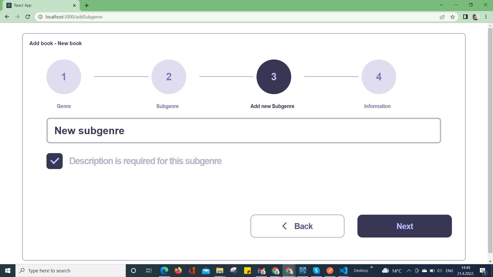
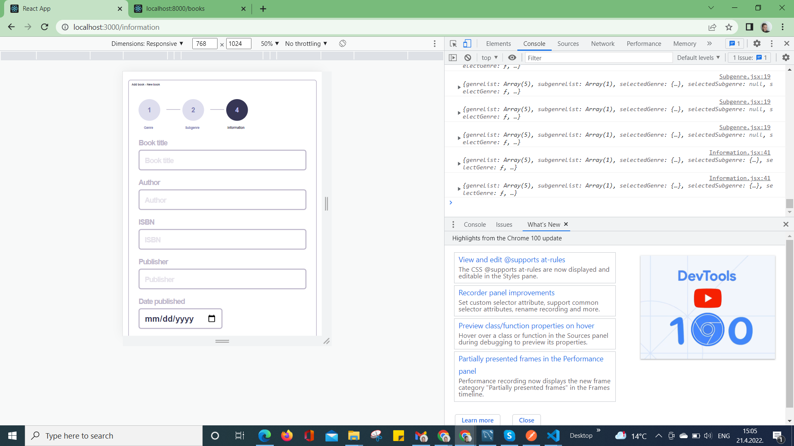
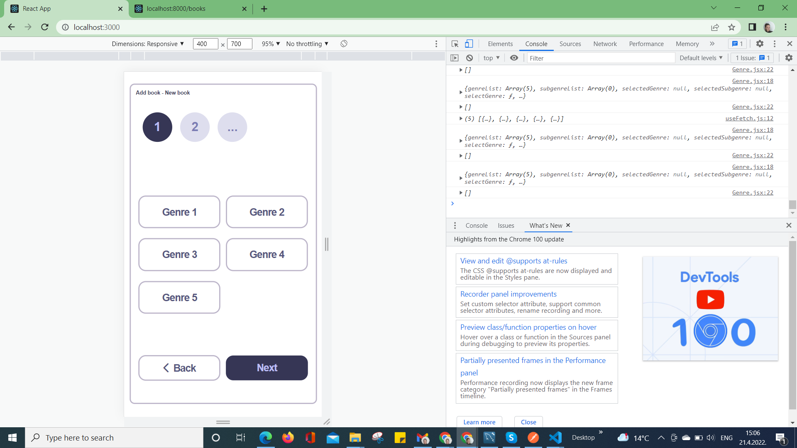

# Tatjana Marković Vortex-app React  solution

## Table of contents

  - [Instructions](#instructions)
  - [The challenge](#the-challenge)
  - [Screenshot](#screenshot)
  - [Links](#links)
  - [Built with](#built-with)
  - [Author](#author)

## Instructions

start json-server in the second terminal window with 
npx json-server --watch data/db.json --port 8000

Resources
  http://localhost:8000/genres
  http://localhost:8000/books

  Home
  http://localhost:8000

    
### The challenge

Frontend Engineer Task
Write a wizard that will allow librarians to navigate through various steps to add a new book to the system. Candidates can use any framework of choice or no framework at all. The finished task should be published to a public Github repository.

Requirements

1.	The wizard should have a maximum of 4 steps
a.	Genre
b.	Subgenre
c.	Add subgenre
d.	Information
2.	The number of steps can change dynamically depending on previously answered questions, with the steps indicator at the top of the page only displaying the available steps. Usually, you will have three steps, but if the user chooses to add a new subgenre, you will have four steps.
3.	A user can move to the next step only after they choose an answer (genre and subgenre), or populate and submit a form (add subgenre and information). The form should be submitted by using a fake fetch technique that will console the log request.
4.	The user can always navigate back to the beginning of the wizard.
5.	The last step button should always have a Complete flow instead of a Next step label.
6.	A description in the information form is required only if the selected subgenre is flagged - {“isDescriptionRequired”: true}.
7.	When a user comes to the end, the wizard should be able to restart.

### Screenshot

### Links

- Solution URL: [GitHub](https://github.com/tatjama/vortex-app/tree/develop)
### Built with

1. React.js
2. React-router-dom
3. json-server
## Author

- Website - [Tatjana Markovic](https://my-react-portfolio-tatjana.vercel.app/)
- LinkedIn - [Tatjana Marković](https://www.linkedin.com/in/tatjana-markovi%C4%87-919501189/)
- GitHub - [tatjama](https://github.com/tatjama)

